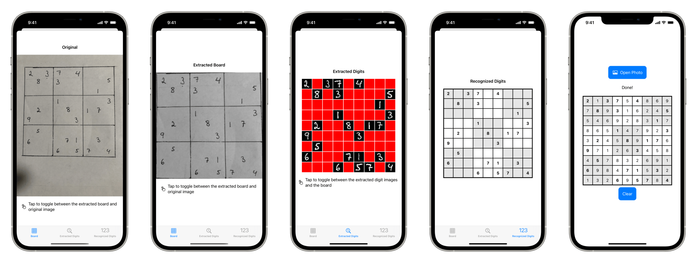

# Sudoku Solver

## Setup

Download [OpenCV](https://github.com/opencv/opencv) version 4.5.0 for iOS and
move the `opencv2.framework` bundle into the `Frameworks` folder. You may have
to build OpenCV yourself to get the Swift bindings to work due to differing
Swift compiler versions, see [this
page](https://docs.opencv.org/master/d5/da3/tutorial_ios_install.html) for
instructions.

Classification of the digits in each cell is done using a CoreML model trained
on the [MNIST](http://yann.lecun.com/exdb/mnist/) dataset. Download a pretrained
model from Apple [here](https://developer.apple.com/machine-learning/models/)
and place `MNISTClassifier.mlmodel` into the root folder of the project.
